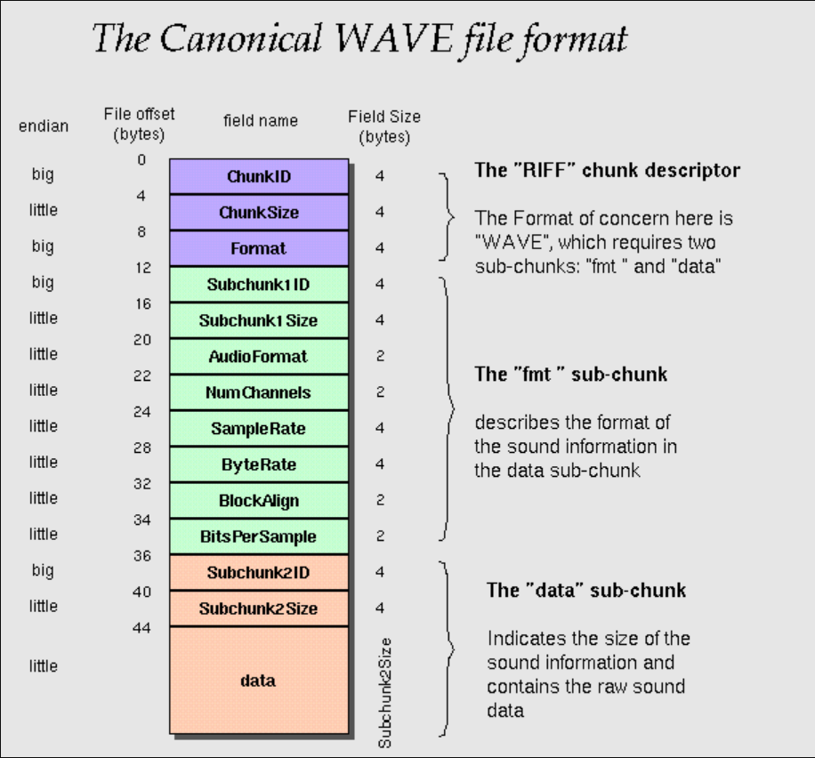
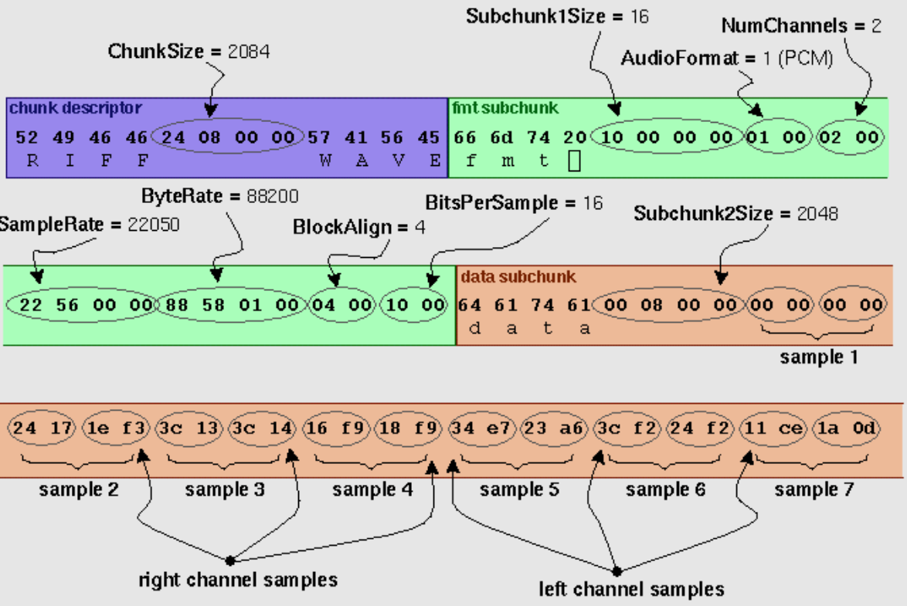
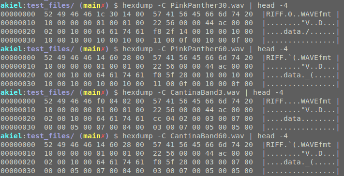

# dist-fs
Distributed File System (maybe?)

This is a **rough** draft of a project idea for a distributed filesystem that replace our (Chico and I's) need for dropbox.

Easy build with:

```
mkdir build && cd build
cmake ../
make
```

## Some things for me to do
- Figure out how to make the raspberry pi accessible from outside my network for chico to talk to
- Guide to get started

## Details

The main idea here to start is to create a simple file system on a Raspberry pi, in memory, and 
contained in a single process (a single running task on linux). There will then need to be an
interface to some sort of web interface. It should ideally be encrypted but to start who cares.
To start, we don't care about the "distributed" part, just an accesible common file system we
can append (add something to the end)

### Some tasks
#### File System
- [ ] **Start** with a simple CLI util that can be ran...
    - `./dist-fs --upload <wav>`
    - `./dist-fs --download <wav>`
  - Think about how dynamic this should be. We could start with just supporting `.wav`, `.mp3`, other audio formats?
  - [ ] start with parsing a wave file, what is its format?
    - https://en.wikipedia.org/wiki/WAV
    - https://en.wikipedia.org/wiki/WAV#WAV_file_header
  - [ ] figure out addressing, how to get a chunk of memory allocated to us cleanly
    - how can it grow/shrink? this think shouldn't grow in size unless files get added
  - [ ] Figure out reading/writing to the samsung SSD I have
    - 500gb
    - This will be the "file system." audio files are large, will need a decent chunk of space
       
#### Networking
- [ ] Make the file system available in some way
no idea what this will look like right now


## wav file format
- https://en.wikipedia.org/wiki/WAV
- https://en.wikipedia.org/wiki/WAV#WAV_file_header
- http://soundfile.sapp.org/doc/WaveFormat/




Some explanation for the image above on what the file header + data look like. 


Notice this hexdump of the `.wav` files under `test_files/` and the pieces of the file header we 
can see:

Test `.wav` files are from this UIC CS site: https://www2.cs.uic.edu/~i101/SoundFiles/
